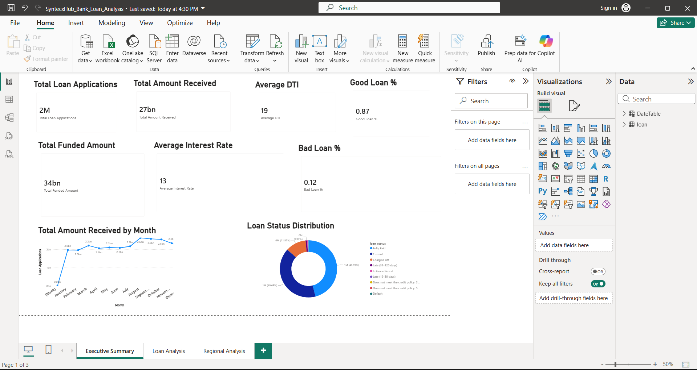
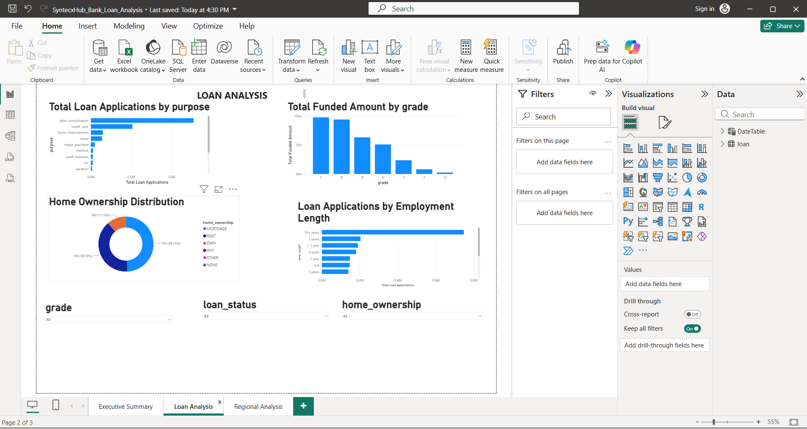
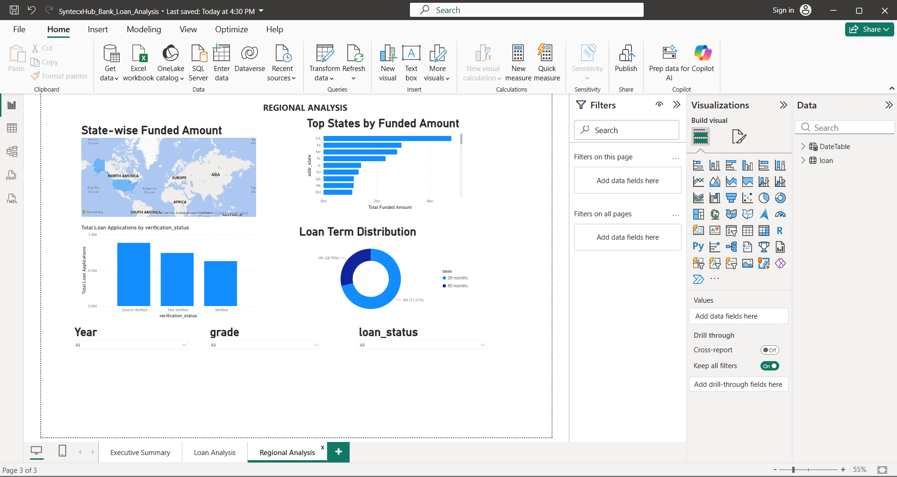

# 📊 Bank Loan Analysis Dashboard

> **A comprehensive Power BI dashboard developed as part of the SyntecxHub Data Analytics Internship (Task-4) to analyze bank loan performance, customer behavior, and regional lending trends.**

---

## 📖 Project Overview

The **Bank Loan Analysis Dashboard** provides an interactive view of loan data using Power BI. It helps users monitor loan applications, funded amounts, repayments, customer profiles, and regional performance through dynamic KPIs and visualizations.

This dashboard enables data-driven decision-making by presenting key business insights in an easy-to-understand format.

---

## 🎯 Objectives

- Analyze loan applications and funding trends.
- Track loan repayment performance.
- Identify good and bad loan percentages.
- Understand customer demographics.
- Compare loan distribution across grades, purposes, and regions.
- Build an interactive business intelligence dashboard.

---

## 🛠️ Tools & Technologies

- 📊 Power BI
- 📈 Power Query
- 🧮 DAX (Data Analysis Expressions)
- 📁 Microsoft Excel / CSV Dataset

---

## 📌 Dashboard Features

### 📄 Executive Summary
- Total Loan Applications
- Total Funded Amount
- Total Amount Received
- Average Interest Rate
- Average DTI
- Good Loan Percentage
- Bad Loan Percentage
- Monthly Loan Application Trend
- Loan Status Distribution

---

### 📄 Loan Analysis
- Loan Applications by Purpose
- Funded Amount by Grade
- Employment Length Analysis
- Home Ownership Distribution
- Interactive Slicers

---

### 📄 Regional Analysis
- State-wise Funded Amount
- Loan Term Distribution
- Verification Status Analysis
- Regional Performance Comparison

---

# 📸 Dashboard Preview

## Executive Summary



---

## Loan Analysis



---

## Regional Analysis



---

## 📊 Key Performance Indicators (KPIs)

| KPI | Description |
|------|-------------|
| Total Loan Applications | Total number of loan applications |
| Total Funded Amount | Total amount sanctioned |
| Total Amount Received | Total repayments received |
| Average Interest Rate | Average loan interest rate |
| Average DTI | Average Debt-to-Income Ratio |
| Good Loan % | Percentage of healthy loans |
| Bad Loan % | Percentage of risky loans |

---

## ✨ Key Insights

- Identified monthly trends in loan applications.
- Compared funded amounts across loan grades.
- Analyzed loan purposes with the highest demand.
- Evaluated customer home ownership patterns.
- Studied employment length and loan behavior.
- Performed state-wise loan funding analysis.

---

## 📂 Repository Structure

```
SyntecxHub_Bank_Loan_Analysis
│
├── SyntecxHub_Bank_Loan_Analysis.pbix
├── README.md
├── Executive_Summary.png.png
├── Loan_Analysis.png.png
└── Regional_Analysis.png.png
```

---

## 🚀 How to Use

1. Clone this repository.
2. Open `SyntecxHub_Bank_Loan_Analysis.pbix` in Power BI Desktop.
3. Interact with the slicers to filter data.
4. Explore insights across all dashboard pages.

---

## 👩‍💻 Author

**Srinithya Polneni**

🎓 B.Tech – Computer Science & Engineering (AI)  
📍 Warangal, Telangana, India

### Connect with me

- 🔗 GitHub: https://github.com/srinithyapolineni
- 💼 LinkedIn: *(Add your LinkedIn profile URL here)*

---

## ⭐ Internship Project

**Organization:** SyntecxHub  
**Domain:** Data Analytics  
**Task:** Task-4 – Bank Loan Analysis Dashboard using Power BI

---

### ⭐ If you found this project helpful, consider giving this repository a Star!
